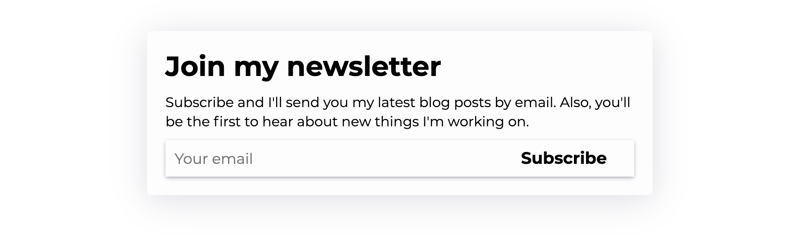

# React Subscribe Card

[](https://www.npmjs.com/package/react-subscribe-card) [](https://standardjs.com)

## Requirements

Requires React and...

1. Mailchimp account

or

2. TinyLetter account

## Example



```js
import React from "react";
import SubscribeCard from "react-subscribe-card";

const mailchimpURL = `[Your Mailchimp subscription URL]`;

const outerCardStyle = `
      padding: 0;
      box-shadow: 0px 5px 35px 0px rgba(50, 50, 93, 0.17);
    `;
const subContainerStyle = `
      box-shadow: 0 2px 5px -1px rgba(50,50,93,.25), 0 1px 3px -1px rgba(0,0,0,.3);
      align-items: center;
    `;
const subInputStyle = `
      border-width: 0;
      margin: 0;
    `;
const subButtonStyle = `
      border-radius: 0;
      flex-grow: 1;
      background-color: #fdfdfd;
      color: #000000;
    `;

const App = () => (
  <div>
    <SubscribeCard
      mailchimpURL={mailchimpURL}
      outerCardStyle={outerCardStyle}
      subContainerStyle={subContainerStyle}
      subInputStyle={subInputStyle}
      subButtonStyle={subButtonStyle}
    />
  </div>
);

export default App;
```

## Installation

```bash
yarn add react-subscribe-card
# or
npm install --save react-subscribe-card
```

## Usage

```
# ES6 import
import SubscribeCard from "react-subscribe-card"
```

## Props

- `mailchimpURL`: `String`

  - To get your Mailchimp subscription URL, go to Mailchimp Form Builder > select Embedded forms > look at embedded HTML and copy the `action` URL in the `<form>`.

- `tinyletterUsername`: `String`
  - Your TinyLetter username

_Note: Only use `mailchimpURL` or `tinyletterUsername` prop. If you use both, `mailchimpURL` will take precedent._

- `title`: `String`

  - Title of your card
  - default: "Join my newsletter"

- `description`: `String`

  - Description of your card
  - default: "Subscribe and I'll send you my latest blog posts by email. Also, you'll be the first to hear about new things I'm working on."

- `emailPlaceholder`: `String`

  - Placholder for user input email
  - default: "Your Email"

- `buttonText`: `String`

  - Text of the submit button
  - default: "Subscribe"

#### The following props are strings, but you must format as CSS to override the default styles

This component is using styled-components. Reference the [styled-components website](https://www.styled-components.com/) to see more on specific formatting. You can [nest rules just like Sass](https://www.styled-components.com/docs/faqs#can-i-nest-rules).

- `outerCardStyle`: `String`

  ```js
  // default
  `box-sizing: border-box;
    position: relative;
    background-color: #f2f2f2;
    border-radius: 8px;
    padding: 8px;
    margin: 48px auto;
    max-width: 90%;
    width: 550px;`;
  ```

- `innerCardStyle`: `String`

  ```js
  // default
  `background-color: #fdfdfd;
    border-radius: 4px;
    padding: 20px;
    margin: 0;`;
  ```

- `titleStyle`: `String`

  ```js
  // default
  `font-family: system-ui, -apple-system, BlinkMacSystemFont, "Segoe UI", Roboto, "Helvetica Neue", Arial, sans-serif;
  font-size: 30px;
  font-weight: 800;
  margin: 0 0 10px 0;
  text-align: left;
  word-break: break-word;`;
  ```

- `descriptionStyle`: `String`

  ```js
  // default
  `font-family: system-ui, -apple-system, BlinkMacSystemFont, "Segoe UI", Roboto, "Helvetica Neue", Arial, sans-serif;
  font-size: 15px;
  font-weight: 400;
  line-height: 21px;
  margin: 0 0 10px 0;
  text-align: left;`;
  ```

- `subContainerStyle`: `String`

  ```js
  // default
  `display: flex;
  
  @media all and (max-width: 500px) {
    flex-direction: column;
  }`;
  ```

- `subInputStyle`: `String`

  ```js
  // default
  `font-family: system-ui, -apple-system, BlinkMacSystemFont, "Segoe UI", Roboto, "Helvetica Neue", Arial, sans-serif;
  background-color: #fdfdfd;
  color: #333333;
  border-color: #f2f2f2;
  border-style: solid;
  border-width: 5px;
  font-size: 16px;
  height: 40px;
  line-height: 20px;
  margin-bottom: 10px;
  margin-top: 0;
  padding: 10px 10px;
  box-sizing: border-box;
  width: 70%;
  max-width: 100%;
  margin-right: 16px;
  
  @media all and (max-width: 500px) {
    width: 100%;
  }`;
  ```

- `subButtonStyle`: `String`

  ```js
  // default
  `font-family: system-ui, -apple-system, BlinkMacSystemFont, "Segoe UI", Roboto, "Helvetica Neue", Arial, sans-serif;
  background-color: #000000;
  border: none;
  border-radius: 25px;
  box-shadow: none;
  color: #ffffff;
  font-size: 18px;
  font-weight: 700;
  height: 40px;
  line-height: 20px;
  padding: 10px 20px;
  box-sizing: border-box;
  display: inline-block;
  cursor: pointer;
  
  &:hover {
    box-shadow: inset 0 0 100px 100px rgba(255, 255, 255, 0.25);
  }`;
  ```

- `responseStyle`: `String`
  ```js
  // default
  `font-family: system-ui, -apple-system, BlinkMacSystemFont, "Segoe UI", Roboto, "Helvetica Neue", Arial, sans-serif;
  font-size: 15px;
  font-weight: 600;
  line-height: 21px;
  text-align: center;
  margin: 0;
  margin-top: 4px;`;
  ```

## License

MIT © [thomaswangio](https://github.com/thomaswangio)
